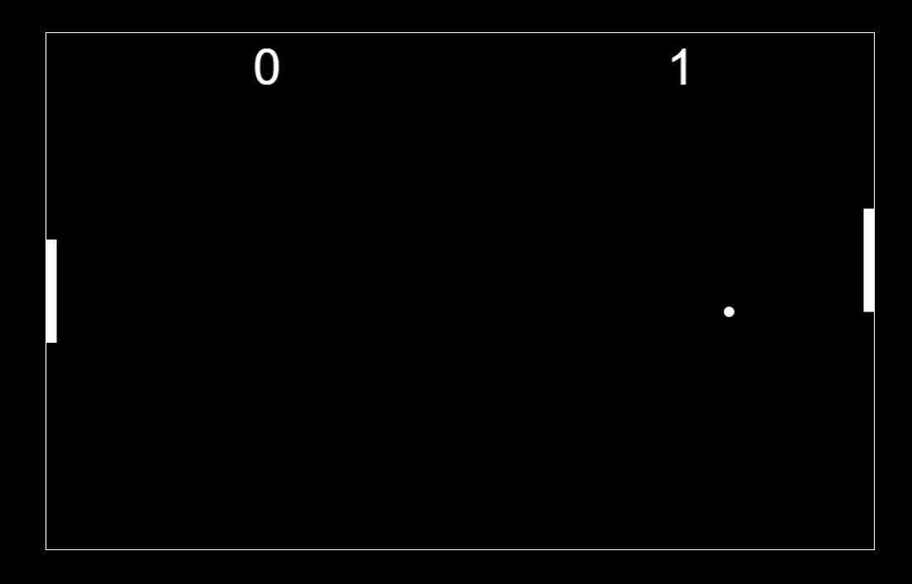

# Pong Game 🏓

Welcome to the Pong Game repository! This project is a recreation of the classic Pong arcade game, one of the earliest video games ever made. It's simple yet fun, and a great way to step back in time and experience the dawn of the video game era.



## Table of Contents

- [Getting Started](#getting-started)
- [How to Play](#how-to-play)
- [Technologies Used](#technologies-used)
- [Contributing](#contributing)
- [License](#license)

## Getting Started

To get started, you can either download the source code as a ZIP file or clone this repository using Git:

```sh
git clone https://github.com/Placaflaca00/pong-game.git

Then, open the index.html file in your favorite browser to start playing the game.

How to Play
The objective of Pong is to score points by making the ball touch the opponent's side of the screen. Here are the controls:

Use the Up Arrow key to move your paddle up.
Use the Down Arrow key to move your paddle down.
The first player to reach 10 points wins the game.

Technologies Used
This Pong Game is built using the following technologies:

HTML5
CSS3
JavaScript
Canvas API
Contributing
If you have any ideas for improvements, feel free to contribute! Here's how you can get started:

Fork the repository.
Create a new branch for your feature (git checkout -b my-feature).
Commit your changes (git commit -am 'Add my feature').
Push your changes to the branch (git push origin my-feature).
Create a new pull request.
License
This project is licensed under the MIT License. See the LICENSE file for more information.

Happy gaming! 🎮
